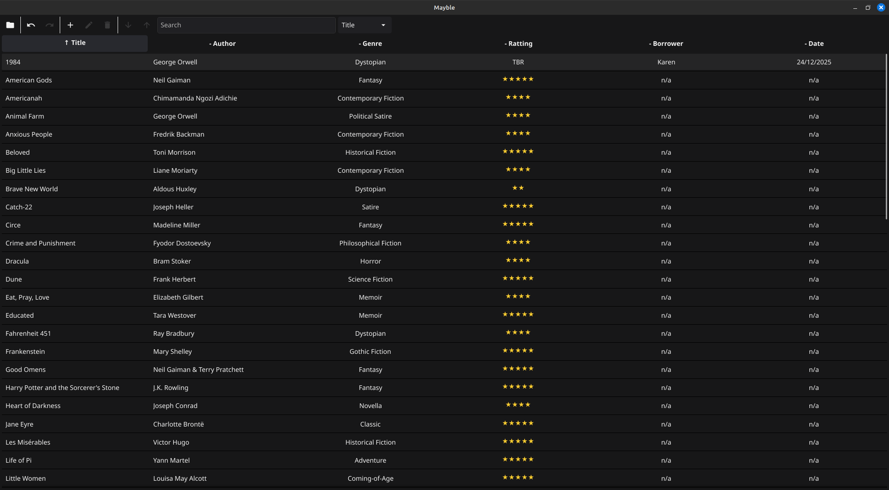

# Mayble

A desktop application book management for a family member.

My sister has a collection of physical books, and wants to keep track of what book has been read, and to whom she lent them out to. And so she asked me to make this application to help her out.

The [requirements](requirements.txt) my sister gave me, and the build targets are for MacOS and ChromeOS. Windows is not a priority for her.




## Features.

- Sorting by column.

- Column based text Searching.

- Undo and redo changes.

- Import and export with CSV.

- Ratting go from TBR (to be read) to 5 stared.

# Compile and Run

With go installed, to do a quick test run you can run:

```sh 
go run .
```

# Packaging 

These notes are mainly for myself for if, or when I need to make updates, and release a new version.
Remembering how to build these packages, and having quick links with in the build environments.


## MacOS

The MacOS build is created using [OSX-KVM](https://github.com/kholia/OSX-KVM) for a proper build environment. (I hit road blocks using cgo and fyne-cross for Linux to Mac cross-compilation).

NOTE: Mayble Can't run under [OSX-VM](https://github.com/kholia/OSX-KVM) without GPU pass-through. OpenGL will crash  the app under a virtual Graphics.

Requirements

``` sh
xcode-select --install

go install github.com/fyne-io/fyne@latest
```

Build

``` sh
GOARCH=ARCH fyne package -os darwin
```


## Debian / ChromeOS

The ChromeOS build uses a `.deb` package for the Linux Development Environment.

NOTE: This package is not intended for general Debian deployment and only for [personal use](https://wiki.debian.org/MakeAPrivatePackage).


**Requirements**

Fyne packaging tools

``` sh
go install github.com/fyne-io/fyne-cross@latest

go install github.com/fyne-io/fyne@latest
```

`fyne-cross` command requires docker.

Debian package building

``` sh
sudo apt update
sudo apt install build-essential devscripts debhelper dh-make fakeroot
```

NOTE: I don't think all those packages are need, for a personal use package, but just in case.

Creating package.

``` sh
fyne-cross linux -arch=ARCH      # ARCH = amd64, or arm64
./package-deb.sh ARCH            # Create Debian packages of selected ARCH
```

The `package-deb.sh` script will take the Linux tarball created by `fyne-cross` and creates a Debian package with it.

The resulting Debian package will be in `./build/deb/mayble-X.X.X.deb`


