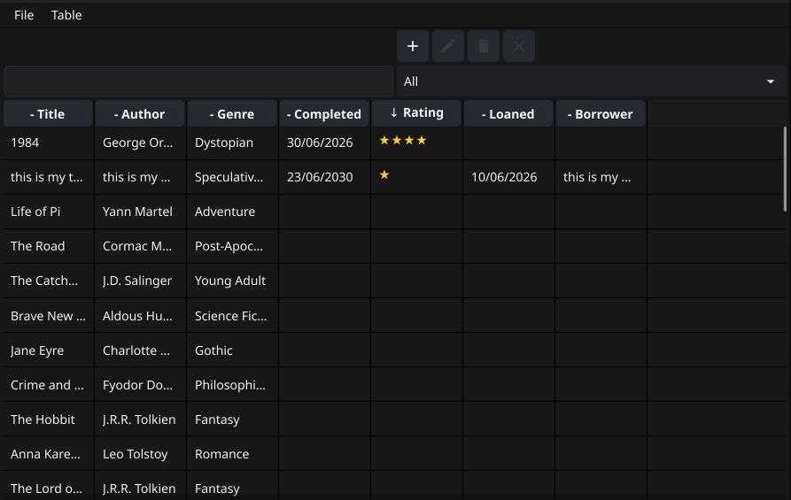

# Mayble

A simple desktop book management application.



## Motivation

I was asked by a family member of mine, whom has a collection of physical books, needed a way to keep track of them, and asked be to create this CRUD application. Its aim is too keep track on what book has been read and what has been loaned out, without needing to use pen and paper to keep track of them.

## Quick Start

1. Pull down repo.

``` sh
git pull github.com/dubbersthehoser/mayble
```

2. Install Fyne Framework's dependencies.

**Ubuntu**

``` sh
sudo apt-get install golang gcc libgl1-mesa-dev xorg-dev libxkbcommon-dev
```

**Other Platforms**

[Check Fyne's docs for your specific platform.](https://docs.fyne.io/started/quick/)

*Note on platforms:* Mayble was created for desktop usage only in mind, so avoid the phone OS versions.

3. Build and Run

Now you can run `go run .` to try it out.

## Usage


## Contributing

I'm not looking for contributors for this project. My aim was to help one person, but I would look at any issue reports and request if they do pop up.
