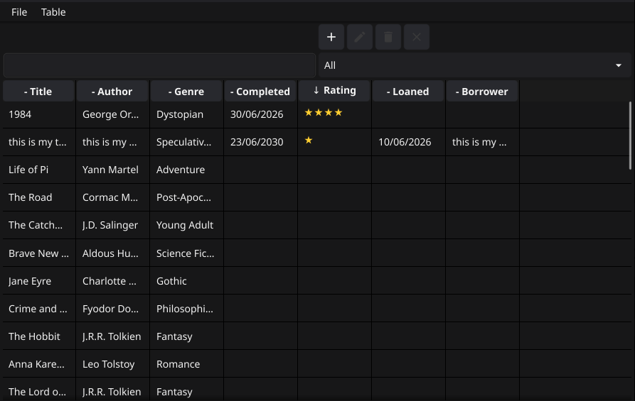

# Mayble

A simple desktop book management application.



## Motivation

I was asked by a family member of mine, whom has a collection of physical books, and needed a way to keep track of them without needing pen and paper, and so I create this CRUD application for them. The application's aim is to keep track of what book has been read, and what has been loaned out, and to whom.

## Quick Start

There are pre-build packages in the [release page](https://github.com/dubbersthehoser/mayble/releases/latest).

*note:* For the **Linux** package, once extracted you can run the binary directly from the `/usr/share/bin/` directory.

### But my platform is not in the releases?

Then build from source.

1. Clone down repo: `git clone github.com/dubbersthehoser/mayble`

1. Install dependencies.
   - **Linux (Debian):** 
     ```
     sudo apt-get install golang gcc libgl1-mesa-dev xorg-dev libwayland-dev libxkbcommon-dev
     ```

   - **MacOS:** As long you have `xcode` installed. 
     ```
     xcode-select --install
     ```
   - **Other:** Check [fyne quick start](https://docs.fyne.io/started/quick/).

1. Install the Go language (v1.24.0 or higher), and a C Compiler for graphics libraries.

1. Finally `go run .` and try it out!

## Usage

The application starts without a database. You'll need to create a database which is done in the menu *File* drop down.

Open the *help* menu to open the manual, or open [./doc/manual.md](./doc/manual.md).

## Contributing

I'm not looking for contributors for this project. My aim was to help one person, but I'll consider any issue reports or request if they pop up.
