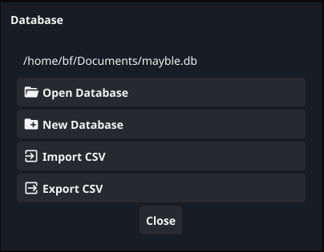

# Mayble Manual

Version: 1.0.0

## Overview

1. Database management menu. Creating, and opening database files, and importing, and exporting via CSV.

1. Undo and redo changes.

1. Create entry, edit, or delete selected book entry.

1. Next, and previous search matched item.

1. Text search entry.

1. Search field selection.

1. Table header, and table ordering.

## Database Management Menu

### Creating Files

When creating a file, be it exporting ~.csv~ or creating database file, with in the file dialog, the file name extension is **not required**. The appropriate extension will be append to the name if the extension is not found.

